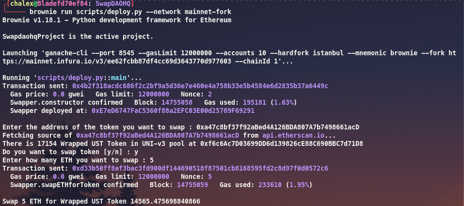
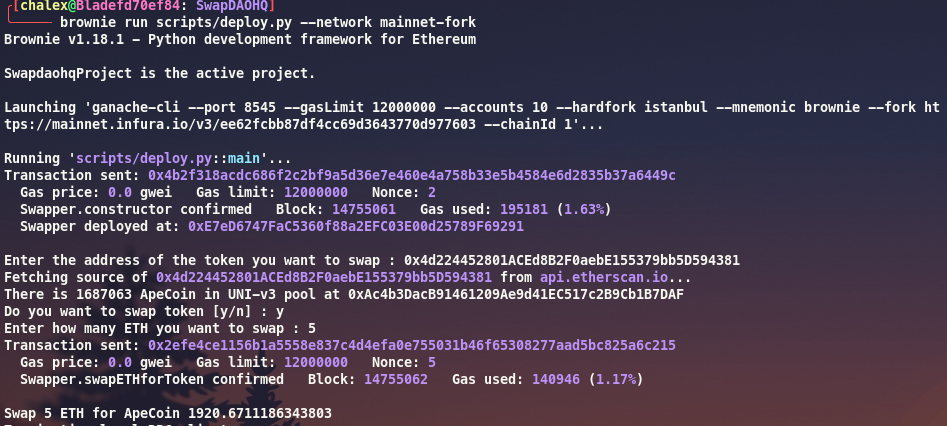

## Requirements

To run the project you need:

- Python 3.8 local development environment and Node.js 10.x development environment for Ganache.
- Brownie local environment setup. See instructions for how to install it
  [here](https://eth-brownie.readthedocs.io/en/stable/install.html).
- Local env variables for [Etherscan API](https://etherscan.io/apis) and
  [Infura](https://infura.io/) (`ETHERSCAN_TOKEN`, `WEB3_INFURA_PROJECT_ID`,`PRIVATE_KEY`).
- Local Ganache environment installed with `npm install -g ganache`.

## Explanations

This repo contain the code for making a swap using UNI-V3 route.
Swapper is a contract that allow you to perform a swap through UniswapV3.
The swap is done between native ETH and the token of your choices.
The script will check if there is liquidity in the pool and let you know the liquidity available.
If you are happy with the liquidity you can choose how many ETH you want to swap.

## Instructions

This repo is intended to work in a mainnet fork env.

To run the script use ```brownie run scripts/deploy.py --network mainnet-fork```

Follow the instructions provided in your terminal prompt.

## Examples

- Example 1 : Swapping 5 ETH for UST (lol)



You will notice that the UNI pool contains only 17k of UST liquidity.

- Example 2 : Swapping 5 ETH for APE Coin



## Improvements

This contract is very basic and only use UNI-v3 route.
To improve the Swapper contract, we can add more route (such as UNI-v2 or other AMM), we can also integrate an aggregator in our contracts for making swaps (such as 1inch, Paraswap ...).
To check the liquidty in USD or ETH value of the pool where we want to swap the token, we could implement UNI-v3 TWAP as on-chain oracle to query the liquidity available. In our case it is better to implement liquidity check off-chain, this is an unecessary gas consuming task to do it on-chain in our case.
